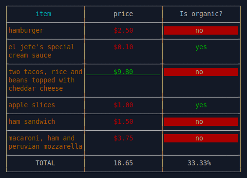
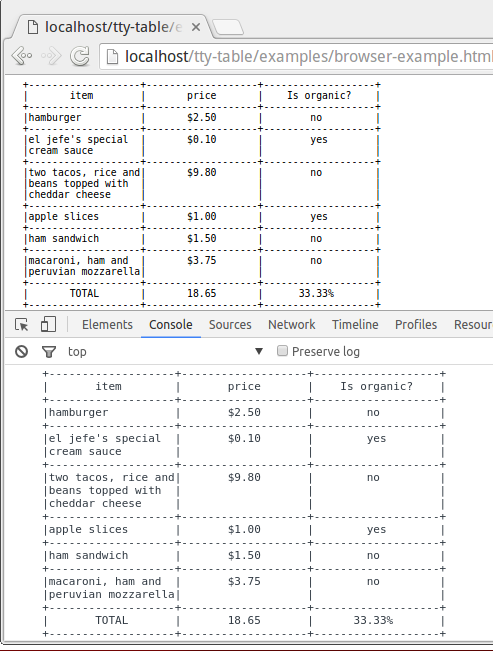

# tty-table

A terminal table widget for nodejs and the browser.

## Installation

- Nodejs

```
npm install tty-table
```

- Browser (via browserify)

```
<script src="tty-table.bundle.min.js"></script>
<script>
	var Table = require('tty-table');
	...
</script>
```

## Why

- Automatic text wrapping
- Colors (nodejs)
- Optional callbacks on column values
- Header, body column alignment
- Padding
- Pass rows as either arrays or objects
- Works in the browser as well as nodejs

## Example Output

### Terminal
 

### Browser & Browser Console 
 

[Working example](http://htmlpreview.github.io/?https://raw.githubusercontent.com/tecfu/tty-table/master/examples/browser-example.html)

> Note that neither ASCI colors nor default borders are rendered in the browser.
> An alternative border style, as shown below, can be used by setting the option:
>
> ```
> borderStyle : 2
> ```

## Example Usage

<!--EXAMPLE-USAGE-->

```
var Table = require('tty-table');
var chalk = require('chalk');

var header = [
	{
		value : "item",
		headerColor : "cyan",
		color: "yellow",
		align : "left",
		paddingRight : 5,
		width : 30
	},
	{
		value : "price",
		color : "red", 
		formatter : function(value){
			var str = "$" + value.toFixed(2);
			if(value > 5){
				str = chalk.underline.green(str);
			}
			return str;
		}
	},
	{
		alias : "Is organic?",	
		value : "organic",
		formatter : function(value){
			if(value === 'yes'){
				value = chalk.stripColor(value);
				value = chalk.green(value);
			}
			else{
				value = chalk.white.bgRed(value);
			}
			return value;
		}
	}
];

//Example with arrays as rows 
var rows = [
	["hamburger",2.50,"no"],
	["el jefe's special cream sauce",0.10,"yes"],
	["two tacos, rice and beans topped with cheddar cheese",9.80,"no"],
	["apple slices",1.00,"yes"],
	["ham sandwich",1.50,"no"],
	["macaroni, ham and peruvian mozzarella",3.75,"no"]
];

var t1 = Table(header,rows,{
	borderStyle : 1,
	paddingBottom : 0,
	headerAlign : "center",
	align : "center",
	color : "white"
});

str1 = t1.render();
console.log(str1);


//Example with objects as rows 
var rows = [
	{
		item : "hamburger",
		price : 2.50,
		organic : "no"
	},
	{
		item : "el jefe's special cream sauce",
		price : 0.10,
		organic : "yes"
	},
	{
		item : "two tacos, rice and beans topped with cheddar cheese",
		price : 9.80,
		organic : "no"
	},
	{
		item : "apple slices",
		price : 1.00,
		organic : "yes"	
	},	
	{
		item : "ham sandwich",
		price : 1.50,
		organic : "no"
	},
	{
		item : "macaroni, ham and peruvian mozzarella",
		price : 3.75,
		organic : "no"
	}
];

var t2 = Table(header,rows,{
	borderStyle : 1,
	paddingBottom : 0,
	headerAlign : "center",
	align : "center",
	color : "white"
});

var str2 = t2.render();
console.log(str2);

```
<!--END-EXAMPLE-USAGE-->

## API Reference 
<!--API-REF-->


<!--END-API-REF-->

## Running tests

```
grunt test
```

## License

[GPLv3 License](http://www.gnu.org/licenses/gpl-3.0.en.html)

Copyright 2015, Tecfu. 
