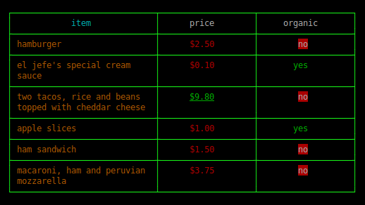

# tec-table

A table widget for CLI applications in nodejs.

<b>Why</b>

- Automatic text wrapping
- Colors
- Optional callbacks on column values

## Example Usage

```
var header = [
	{
		value : "item",
		headerColor : "cyan",
		color: "yellow",
		width : 30
	},
	{
		value : "price",
		color : "red", 
		formatter : function(value){
			var str = "$" + value.toFixed(2);
			if(value > 5){
				str = chalk.underline.green(str);
			}
			return str;
		}
	},
	{
		value : "organic",
		formatter : function(value){
			if(value === 'yes'){
				value = chalk.stripColor(value);
				value = chalk.green(value);
			}
			else{
				value = chalk.white.bgRed(value);
			}
			return value;
		}
	}
];

var rows = [
	["hamburger",2.50,"no"],
	["el jefe's special cream sauce",0.10,"yes"],
	["two tacos, rice and beans topped with cheddar cheese",9.80,"no"],
	["apple slices",1.00,"yes"],
	["ham sandwich",1.50,"no"],
	["macaroni, ham and peruvian mozzarella",3.75,"no"]
];

var t1 = Table(header,rows,{
	borderStyle : 1,
	paddingBottom : 0,
	headerAlignment : "center",
	alignment : "center",
	color : "white"
});

var str1 = t1.render();

console.log(str1);
```

## Example Output

 


## API Reference 
<!--API-REF-->
<a name="Table"></a>
## Table
**Kind**: global class  

* [Table](#Table)
  * [Table(header, rows, options)](#new_Table_new)
  * [.render()](#Table.render) ⇒ <code>String</code>

<a name="new_Table_new"></a>
### Table(header, rows, options)

| Param | Type | Description |
| --- | --- | --- |
| header | <code>array</code> |  |
| rows | <code>array</code> |  |
| options | <code>object</code> | Table options |
| options.marginTop | <code>number</code> |  |
| options.marginLeft | <code>number</code> |  |
| options.maxWidth | <code>number</code> |  |
| options.callback | <code>function</code> |  |
| options.headerAlignment | <code>string</code> |  |
| options.alignment | <code>string</code> |  |
| options.paddingRight | <code>number</code> |  |
| options.paddingLeft | <code>number</code> |  |
| options.paddingBottom | <code>number</code> |  |
| options.paddingTop | <code>number</code> |  |
| options.color | <code>string</code> |  |
| options.headerColor | <code>string</code> |  |
| options.gutter | <code>number</code> |  |
| options.borderStyle | <code>number</code> |  |

**Example**  
```
var Table = require('tec-table');
Table(header,rows,options);
```
<a name="Table.render"></a>
### Table.render() ⇒ <code>String</code>
Renders a table to a string

**Kind**: static method of <code>[Table](#Table)</code>  
**Example**  
```
var str = t1.render(); 
console.log(str); //outputs table
```

<!--END-API-REF-->
